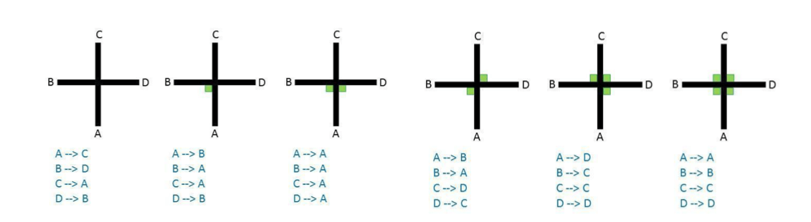
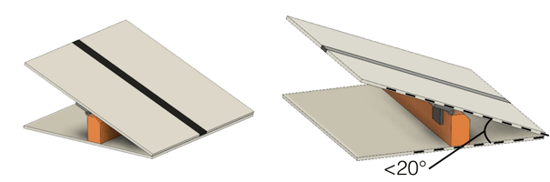
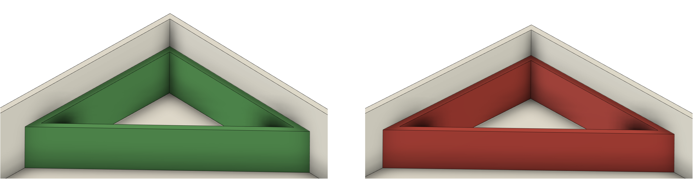

== Field

=== Description

. The field comprises modular tiles, which the organizers can use to make an endless number of courses for the robots to traverse.

. The field will consist of 30 cm x 30 cm tiles with different patterns. The organizers will not reveal the final selection of tiles and their arrangement until the day of the competition. Competition tiles may be mounted on a hard-backing material of any thickness.

. There will be a minimum of 8 tiles in a competition field, excluding the start and goal tiles.

. There are different tile designs (teams can find examples under <<field-line>>).

=== Floor

. The floor is white. The floor may be either smooth or textured (like linoleum or carpet) and may have steps of up to 3 mm in height between tiles. Due to the nature of the tiles, there may be a step or gaps in the construction of the field.

. Competitors should be aware that tiles may be mounted on thick backing or raised off the ground, making it difficult to get back on a tile where the robot comes off the course. No provision will be made to assist robots that drive off a tile to get back onto the tile.

. Robots must be designed to navigate under tiles that form bridges over other tiles. Tiles placed above other tiles will be supported by pillars at tile corners with a square cross-section of 25mm x 25mm, making each tile entrance/exit 25 cm. The minimum height (space between the floor and the ceiling) will be 25 cm.

[[field-line]]
=== Line

. The black line, 1-2 cm wide, may be made with standard electrical insulating tape or printed onto paper or other materials. The black line forms a path on the floor. (The grid lines indicated in the drawings below are for reference only, and competitors can expect tiles to be added or omitted.)

. Straight sections of the black line may have gaps with at least 5 cm of the straight line before each gap as measured from the shortest portion of the straight part of the line. The length of a gap will be no more than 20 cm.

. The arrangement of the tiles and paths may vary between rounds.

. The line will be at least 10 cm away from any edge of the field, walls, pillars to support ramps, seesaws, and obstacles that do not lie ahead of the robot's path.

. The line will end with a goal tile with a 25mm x 300mm strip of red tape in the center of the tile, perpendicular to the incoming line.

[.text-center]
image::media/line_examples.jpg[LINE,pdfwidth=60%,align=center]

=== Checkpoints

. A checkpoint is a tile in which a robot will be manually placed back when a lack of progress occurs.

. Checkpoints will not be located on tiles with scoring elements.

. The start tile is a checkpoint where the robot can restart.

. A checkpoint marker is a marker that indicates for humans which tiles are checkpoints. A disk with 5 mm to 12 mm thickness and up to 70 mm in diameter has been used frequently. Still, it can be different depending on the organizer.

. The field designers will predetermine the number of checkpoint markers and their locations.

=== Speed Bumps, Debris, and Obstacles

. {++The maximun size of a speed bump can be the size of a tile (30cm x 30cm)++} and will have a height of 1 cm or less and be white. When the speed bump is placed over any black line, the overlap between the speed bump and the black line will be colored black. The organizers will fix speed bumps on the floor. 

. Speed bumps may also be placed anywhere in the evacuation zone. Speed bumps in evacuation zone are not scored.

. Debris will have a maximum height of 3 mm. The organizers will not fix it to the floor. The debris consists of small materials such as toothpicks, small wooden dowels, etc.

. Obstacles may include bricks, blocks, weights, and other large, heavy items. Obstacles will be at least 15 cm high and can be fixed to the floor.

. An obstacle will not occupy more than one line or tile.

. A robot is expected to navigate around obstacles. The robot may move obstacles, but obstacles may be very heavy or fixed to the floor. Obstacles will remain where they were moved to, even if that prevents the robot from proceeding.

. Obstacles will not be placed closer than 25 cm from the edge of the field (including edges of tiles that are elevated by ramps) and inclined tiles.

. In the evacuation zone, obstacles may be placed anywhere with a minimum of 10 cm clearance from the wall. Obstacles in the evacuation zone are not scored.

=== Intersections and Dead Ends

. The organizers can place intersections anywhere except in the evacuation zone.

. Intersections markers are green and 25 mm x 25 mm in dimension. They indicate the direction of the path the robot should follow.

. The robot should continue straight ahead if there is no green marker at an intersection.

. A dead end is when there are two green marks before an intersection (one on each side of the line); in this case, the robot should turn around.

. The intersections are always perpendicular but may have 3 or 4 branches.

. Intersection markers will be placed just before the intersection. See the images below for possible scenarios.

[.text-center]
image::media/intersections_possibilities_1.png[INTER1,width=700,pdfwidth=70%,align=center]
image::media/intersections_possibilities_2.png[INTER2,width=700,pdfwidth=70%,align=center]

=== Ramps

. Tiles will be used as ramps to allow the robots to 'climb' up and down from different levels.

. Ramps will not exceed an incline of 25 degrees from the horizontal.

. More than one tile may be used to build one ramp up or down. {--Despite the number of tiles used in the construction, the ramp will be scored as one ramp as it takes from one level to another.--}

. {~~The ramp will be scored when the robot reaches the horizontal tile at the upper level after an ascending ramp or the horizontal tile at the bottom level after a descending ramp.~>The ramp points will be awarded for each individual ramp tile instead of the entire ramp.~~}

. The line along the ramps can contain gaps, speed bumps, intersections, obstacles and debris.

. {++The ramp must NOT have a drop-off immediately following a rise section, creating a peak-line structure or viceversa.++}

=== Seesaws

. A seesaw is a tile that can pivot around a hinge in the center of a regular tile.

. The seesaw will have an incline less than 20 degrees when tilted to one side.

. The seesaw tile will have a straight line with no scoring elements present.

[.text-center]

=== Evacuation Zone

. The black line will end at the entrance of the evacuation zone.

. The black line will begin again at the exit of the evacuation zone.

. The evacuation zone is 120 cm by 90 cm with walls around the four sides at least 10 cm high and colored white.

. At the entrance to the evacuation zone, there is a 25 mm × 250 mm strip of reflective silver tape on the floor.

. At the exit of the evacuation zone, there is a 25 mm × 250 mm strip of black tape on the floor.

. The organizers may place an obstacle inside the evacuation zone. In the evacuation zone, organizers may put the obstacle anywhere with a minimum of 10 cm clearance from the wall. Obstacles in the evacuation zone are not scored.

. Safe evacuation points are defined by right-angled triangles with sides of 30 cm x 30 cm.
.. There will be one red evacuation point where the dead victim must be placed by the robot and,
.. There will be one green evacuation point where the living victims must be placed by the robot.

. The evacuation points are red and green triangles with 6 cm walls and a hollow center.

. The referee can place the evacuation points in any non-entry/exit corners in the evacuation zone.

. After a Lack of Progress, the referee may place the evacuation points in new corners.

. The organizers will fix the evacuation points to the floor. Still, teams should be prepared for slight movements in the evacuation points.

[.text-center]

=== Victims

. Organizers may locate victims anywhere on the floor of the evacuation zone.

. A victim represents a person and is in the form of a 4-5 cm diameter sphere with an off-center center of mass and a maximum weight of 80 g.

. There are two types of victims:
.. Dead victims are black and not electrically conductive.
.. Living victims are silver, reflect light, and are electrically conductive.

. Organizers will locate the victims randomly in the evacuation zone. There will be precisely two live victims and one dead victim placed in the evacuation zone.

=== Environmental Conditions

. The environmental conditions at a tournament may differ from those at home.  Teams must come prepared to adjust their robots to the conditions at the venue.

. Lighting and magnetic conditions may vary in the rescue field.

. The field may be affected by magnetic fields (e.g., under-floor wiring and metallic objects). Teams should prepare their robots to handle such interference.

. The field may be affected by unexpected lighting interference (e.g., camera flash from spectators). Teams should prepare their robots to handle such interference.

. All measurements in the rules have a tolerance of ±10%.
