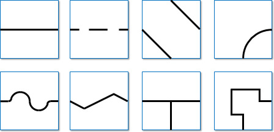
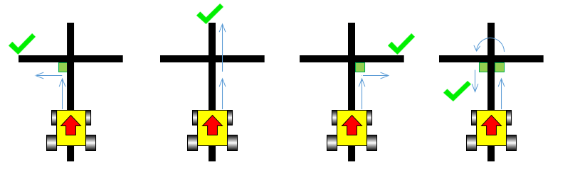
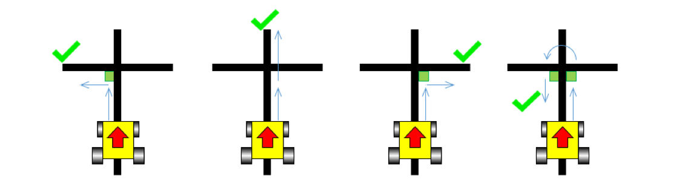
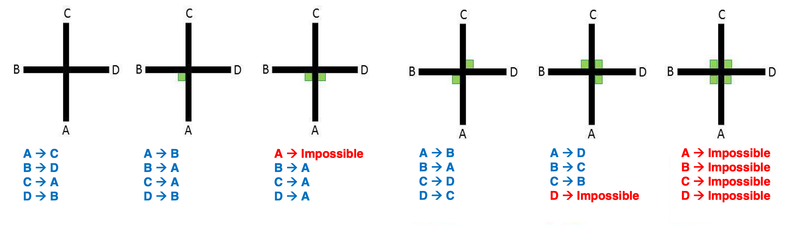
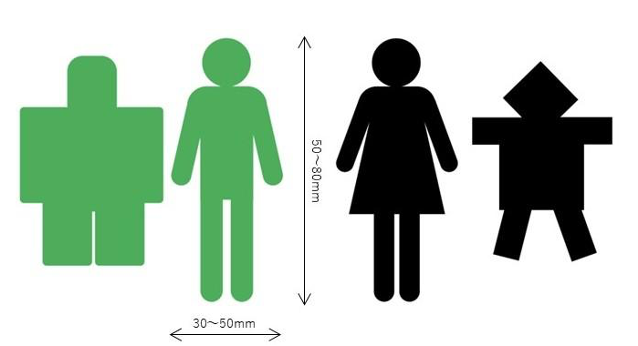
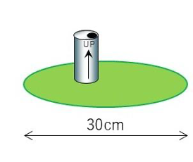
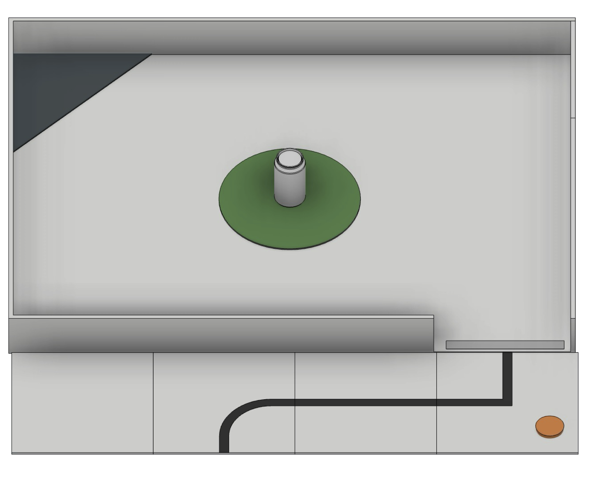

== Field

=== Description

. The field comprises modular tiles, which the organizers can use to make an endless number of courses for the robots to traverse.

. The field will consist of 30 cm x 30 cm tiles with different patterns. The organizers will not reveal the final selection of tiles and their arrangement until the day of the competition. Competition tiles may be mounted on a hard-backing material of any thickness.

. There will be a minimum of 8 tiles in a competition field, excluding the start tile and the evacuation zone.

. There are different tile designs (teams can find examples under <<field-line>>).

=== Floor

. The floor is white. The floor may be either smooth or textured (like linoleum or carpet) and may have steps of up to 3 mm in height between tiles. Due to the nature of the tiles, there may be a step or gaps in the construction of the field.

. Competitors should be aware that tiles may be mounted on thick backing or raised above the floor, which may make it difficult for a robot to return to the course (field) if it leaves the course. No provision will be made to assist a robot in returning to the field if it drives off the field.

. 【Intermediate】Robots must be designed to navigate under tiles that form bridges over other tiles. Tiles placed above other tiles will be supported by pillars at tile corners with a square cross-section of 25mm x 25mm, making each tile entrance 25 cm. The minimum height (space between the floor and the ceiling) will be 25 cm.

[[field-line]]
=== Line

. The black line, 1-2 cm wide, may be made with standard electrical insulating tape or printed onto paper or other materials. The black line forms a path on the floor. (The grid lines indicated in the drawings below are for reference only, and competitors can expect tiles to be added or omitted.)

. Straight sections of the black line may have gaps with at least 10 cm of the straight line before each gap as measured from the shortest portion of the straight part of the line. The length of a gap will be no more than 10 cm.

. The arrangement of the tiles and paths may vary between rounds.

. The line will be at least 10 cm away from the edges of the field and elevated tiles, the pillars that support ramps or the floor raised by the ramp, walls, and (Intermediate only) obstacles that do not lie ahead of the robot’s path.

. The line will end the entrance of the evacuation zone with a 25 mm x 250 mm strip of silver tape. (see 3.8.3)

[.text-center]

=== Checkpoints

. A checkpoint is a tile in which a robot will be manually placed back when a lack of progress (see 5.5) occurs.

. Checkpoints will not be located on tiles with scoring elements.

. The start tile is a checkpoint where the robot can restart.

. A checkpoint marker is a marker that indicates for humans which tiles are checkpoints. A disk with 5 mm to 12 mm thickness and up to 70 mm in diameter has been used frequently. Still, it can be different depending on the organizer.

. The field designers will predetermine the number of checkpoints and their locations.

=== Speed Bumps, Debris, and Obstacles

. The maximum size of a speed bump can be the size of a tile (30 cm x 30 cm) and will have a height of 1 cm or less and be white. When the speed bump is placed over any black line, the overlap between the speed bump and the black line will be colored black. The organizers will fix speed bumps on the floor.

. Speed bumps may also be placed anywhere in the evacuation zone.  Speed bumps in the evacuation zone are not scored.

. A piece of debris will have a maximum height of 3 mm. The organizers will not fix it to the floor. The debris consists of small materials such as toothpicks, small wooden dowels, etc. There may be overlapping debris.

. 【Intermediate】
.. Obstacles may include bricks, blocks, weights, and other large, heavy items. Obstacles will be at least 15 cm high and can be fixed to the floor.
.. An obstacle will not occupy more than one line or tile.
.. A robot is expected to navigate around obstacles. The robot may move obstacles, but obstacles may be very heavy or fixed to the floor. Obstacles will remain where they were moved to, even if that prevents the robot from proceeding.
.. Outside of the evacuation zone, obstacles will not be placed closer than 25 cm from the wall,the edge of the field (including edges of tiles that are elevated by ramps) and inclined tiles.
.. In the evacuation zone, obstacles may be placed anywhere with at least 10 cm away from the wall and 25 cm away from the Evacuation Point. Obstacles in the evacuation zone are not scored.

=== 【Intermediate】 Intersections
There are no intersections in Beginner.
This section is intended for Intermediate.

. The organizers can place intersections anywhere except in the evacuation zone.

. Intersection markers are green and 25 mm x 25 mm in dimension. They indicate the direction of the path the robot should follow.

. The robot should continue straight ahead if there is no green marker at an intersection.

. The intersections are always perpendicular but may have 3 or 4 branches.

. Intersection markers will be placed just before the intersection. See the images below for possible scenarios.

[.text-center]

=== Ramps

. Tiles will be used as ramps to allow the robots to 'climb' up and down from different levels.

. Ramps will not exceed an incline of 25 degrees from the horizontal.

. The ramp points will be awarded for each individual ramp tile instead of the entire ramp.
. The line along the ramps can contain gaps, speed bumps, debris, and (Intermediate only) intersections and obstacles.

. The ramp must NOT have a drop-off immediately following a rise section, creating a peak-line structure or vice versa.

=== Evacuation Zone

. The black line will end at the entrance of the evacuation zone.

. The evacuation zone is 120 cm by 90 cm with walls around the four sides at least 10 cm high.

. At the entrance to the evacuation zone, there is a 25 mm × 250 mm strip of reflective silver tape on the floor.

. 【Intermediate】The organizers may place an obstacle inside the evacuation zone.

. 【Intermediate】There is a victim area within the  evacuation zone. The victim area is a green circle with a diameter of 30 cm.

. 【Intermediate】There is at least one safe evacuation point in the evacuation zone. The evacuation point is a right-angled triangle measuring 30 cm × 30 cm, made of a flat, thin black board or paper with a thickness of 3 mm or less.

. 【Intermediate】The referee can place the evacuation points in any non-entry corner.

. 【Intermediate】After a Lack of Progress (see 5.5) , the referee may place the evacuation points in new corners.

. 【Intermediate】The organizers will fix the evacuation points to the floor. Still, teams should be prepared for slight movements in the evacuation points.

=== Victims

. 【Beginner】
.. Organizers may locate victims anywhere on the floor of the evacuation zone. 
.. A victim represents a person. Its minimum size is 30mm × 50mm and its maximum size is 50mm × 80mm. They are human shaped. The victims are printed on or attached to a floor. 
.. The number of victims may be decided by the competition organizer.
.. There are two types of victims.
... Green victims represent people as living victims.
... Black victims represent dead victims.
.. There may be objects that resemble victims in appearance but are not victims. This includes but is also not colors other than the ones described in this section. Such objects should not be identified as victims by robots.
+
[.text-center]

+
. 【Intermediate】 
1.	The organizers must place each victim at least 10 cm away from all walls and from the edge of the evacuation point.
2.	A victim is represented by a soft drink can. The size should be between 300 ml and 400 ml (approximately 12 oz), and it is recommended to use the most common type of soft drink can in the region. Its weight is between 300 g and 400 g (approximately 12 oz), too. The victim is covered with reflective silver material and is electrically conductive.
3.	The number of victims may be decided by the competition organizer.
4.	If a victim is knocked down by a robot, it must remain in place unless the team captain declares a Lack of Progress.
After the Lack of Progress is declared, the referee will restore the victim to its original upright position at its initial location.  (see Section 5.5, “Lack of Progress”).
+
[.text-center]

=== Environmental Conditions

. The environmental conditions at a tournament may differ from those at home. Teams must come prepared to adjust their robots to the conditions at the venue.

. Lighting and magnetic conditions may vary in the rescue field.

. The field may be affected by magnetic fields (e.g., under-floor wiring and metallic objects). Teams should prepare their robots to handle such interference.

. The field may be affected by unexpected lighting interference (e.g., camera flash from spectators). Teams should prepare their robots to handle such interference.

. All measurements in the rules  are subject to a ±10% tolerance.
