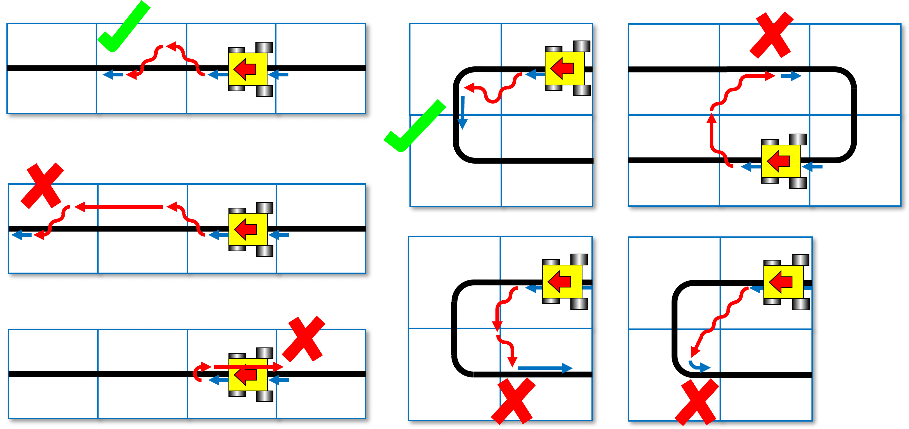
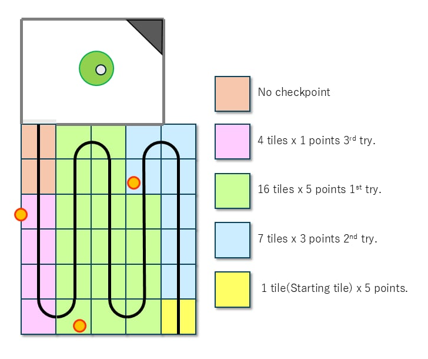
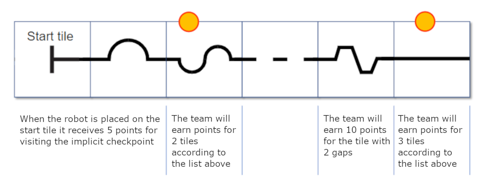
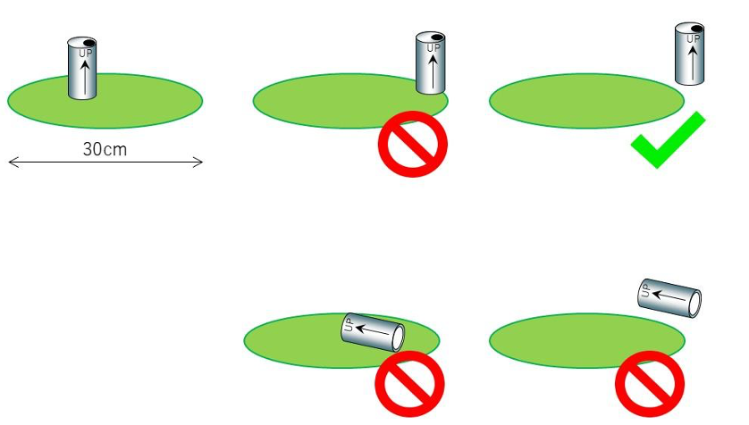
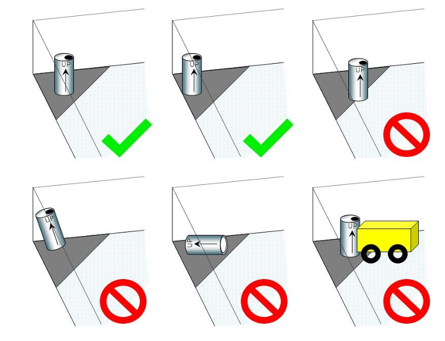

== Play

=== Pre-game Practice

. When possible, teams will have access to practice fields for calibration and testing throughout the competition.

. Whenever there are dedicated independent fields for competition and practice, it is at the organizers' discretion if testing is allowed on the competition fields.

=== Humans

. Teams should designate one of their members as 'captain' and another as 'co-captain'. Only these two team members will be allowed access to the competition fields unless directed by a referee. Only the captain can interact with the robot during a scoring run.

. The captain can move the robot only when they are told to do so by a referee.

. Other team members (and any spectators) within the vicinity of the competition field must stand at least 150 cm away from the field unless directed by a referee.

. No one is allowed to touch the fields intentionally during a scoring run.

. All pre-mapping activities will immediately disqualify the robot for the round. Pre-mapping is the act of humans providing the robot with information about the field (e.g., location of the bstacles and the entrance to the evacuation zone, the directions for avoiding obstacles, the layout of black lines, or the placement of victims inside the evacuation zone, etc…) before the game.

=== Start of Game

. Each team has a maximum of 6 minutes for a game. The game includes the time for calibration and the scoring run.

. Calibration is taking sensor readings and modifying the robot’s programming to accommodate such sensor readings. Calibration does not count as pre-mapping.

. The scoring run is defined as the time when the robot is moving autonomously to navigate the field, and the referee will record the scores.

. A game begins at the scheduled starting time, whether or not the team is present or ready. Start times will be posted around the venue.

. Once the game has begun, the robot is not permitted to leave the competition area.

. Teams may calibrate their robot in as many locations as desired on the field, but the clock will continue to run. Robots are not permitted to move on their own while calibrating.

. Once a team is ready to start a scoring run, the team must notify the referee. To start a scoring run, the robot is placed on the start tile of the course, as indicated by the referee. Once a scoring run has begun, no more calibration is permitted, including changing code/code selection.

. Teams may choose not to calibrate the robot and immediately start the scoring run instead.

. Individual tiles and other scoring elements may be removed, added, or changed when the robot starts moving; to prevent teams from pre-mapping the layout of the fields. These changes may happen based on a die rolled by the referee or with another method of randomization announced by the organizers. For a particular field during a round, the referee will ensure the difficulty of the field will be kept similar, and the maximum points are constant.

=== Scoring Run

. Robots will start behind the joint of the start tile and the subsequent tile along the course. The referee will check the correct placement.

. Modifying the robot during a scoring run is prohibited, which includes remounting parts that have fallen off.

. Any parts the robot loses intentionally or unintentionally will be left in the field until the run is over. Team members and referees cannot move or remove elements from the field during a scoring run.

. Teams cannot give their robot any information about the field. A robot is supposed to recognize the field elements by itself.

. The robot must follow the course completely to enter the evacuation zone and then out of the evacuation zone towards the evacuation zone.

. The robot has reached a tile when more than half the robot is within that tile when viewed from above and the robot is actively following the line at that point in time.

[[loc]]
=== Lack of Progress

. A lack of progress occurs when:
.. a team captain declares a lack of progress.
.. a robot loses the black line without regaining it by the next tile in the sequence (see figures at the end of the section).
.. a robot reaches a line that is not in the intended sequence.
.. a robot exit from the evacuation zone.

. If a lack of progress occurs, the robot must be positioned on the previous checkpoint tile facing the path towards the evacuation zone and checked by the referee.

. After a lack of progress, only the Lack of progress procedure explained to the referee before the run start is allowed to be performed (see <<construction>>).

. There is no limit to the lack of progress within a round.

. After three failed attempts to reach a checkpoint, a robot is allowed to proceed to the next checkpoint.
The team captain may make further attempts at the course to earn additional points from scoring elements that have not already been earned before reaching the next checkpoint.

. If a lack of progress occurs in the evacuation zone, victims (including those that have rolled) shall be returned to any position within the victim area. Rescued victims are not returned. These positions are approximate and not required to be exact. Teams are not allowed to make any requests or complaints regarding the placement of the victims.

[.text-center]

=== Scoring

. A robot is awarded points for successfully navigating each tile with hazards (gaps in the line, speed bumps, intersections, ramps, and obstacles). Points are awarded per hazard when the robot has reached the next tile in sequence. Point allocations are 10 points per tile with one or more gaps, 10 points per tile with one or more speed bumps, 10 points per intersection, 10 points per ramp. 10 points per obstacle.

. Failed attempts at navigating hazards in the field are defined as a Lack of Progress (see <<loc>>). However, if scoring elements are placed on two consecutive tiles and the robot is unable to reach the second tile due to its difficult placement, then successfully reaching the third tile will count as successfully achieving the scoring elements on both the first and second tiles simultaneously.

. When a robot reaches a checkpoint tile, it will earn points for each tile it has passed since the previous checkpoint. The points per tile depend on how many attempts the robot has made:

*	1st attempt = 5 points/tile
*	2nd attempt = 3 points/tile
*	3rd attempt = 1 point/tile
*	Beyond the 3rd attempt = 0 points/tile
+
[.text-center]

. Each gap, speed bump, intersection, ramp, and obstacle can only be scored once per intended direction through the course. Points are not awarded for subsequent attempts through the course.

. The referees will not count any hazards in the evacuation zone towards additional points. 

. No duplicate rewards. For example, suppose a robot successfully crosses a tile with speed bumps multiple times. In that case, only one successful speed bump crossing will be rewarded per tile. The same result applies to all other scoring rules. 

. Victim Detection
+
Points shall be awarded for each successful victim detection within the evacuation zone.
Each successful detection shall be worth 10 points.

+
The robot shall completely remove the victim from the Victim area.
The victim shall be considered detected only after it is fully outside the Victim area. 
+

. Victim Rescue
+
Points shall be awarded for each successful victim rescue within the evacuation zone.
+
A rescue shall be considered successful when the robot places the victim at the evacuation point and the victim (can) remains standing independently for 10 seconds after the robot has completely moved away.
Each successful rescue shall be worth 30 points.
+

=== End of Game

. A team may elect to stop the game early at any time. In this case, the team captain must indicate the team's desire to terminate the game to the referee. The team will be awarded all points earned up to the call for the end of the game. The referee will stop the time at the end of the game, which will be recorded as the game time.

. The game ends when: 
.. The 6 minutes of allowed game time expires 
.. The team captain calls the end of the game.
.. The robot rescues all victims.

