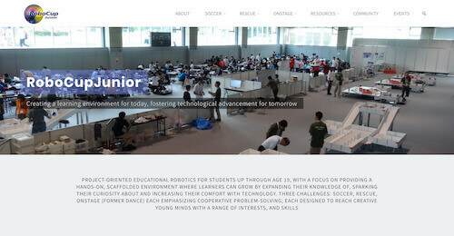

= RoboCupJunior Rescue Line           Rules 2025
Last update: {docdate}
:url-repo: https://gitlab.com/rcj-rescue-tc/line
////
ifdef::pdf-style[]
////
:toc: macro
////
endif::[]
ifndef::pdf-style[]
:toc: left
endif::[]
////
:toc-title: Contents
////
:toc-start: 3
:toc-placement: Summary
////
:sectanchors:
:sectlinks:
:xrefstyle: full
:section-refsig: Section
:sectnums:
:sectnumlevels: 3

ifdef::backend-html5[]
++++
<link rel="stylesheet" href="https://use.fontawesome.com/releases/v5.3.1/css/all.css" integrity="sha384-mzrmE5qonljUremFsqc01SB46JvROS7bZs3IO2EmfFsd15uHvIt+Y8vEf7N7fWAU" crossorigin="anonymous">

++++
endif::[]

:icons: font
:numbered:

[.text-right]

[cols="2,10,2", options="header"]
|===
3+^|RoboCupJunior Rescue Committee 2025

|Chair
|Diego Garza Rodriguez 
|Mexico

|
|Stefan Zauper
|Austria

|
|Csaba Aban Jr.
|Hungary

|
|Joann Patiño
|Panama

|
|Ryo Unemoto
|Japan

|
|Alexander Jeddeloh
|Germany

|
|Gonzalo Zabala
|Argentina

|===

[cols="4,3,4,3", options="header"]
|===
2+^|RoboCupJunior Exec 2025
2+^|Trustees representing RoboCupJunior

|Roberto Bonilla
|USA
|Luis José Lopez Lora
|Mexico

|Marek Šuppa
|Slovakia
|Julia Maurer
|USA

|Marco Dankel
|Germany
|
|

|Margaux Edwards
|Australia
|
|

|Rui Baptista
|Portugal
|
|

|Tatiana Pazelli
|Brazil
|
| 

|Tom Linnemann
|Germany
|
|

|===

[discrete]
== Official Resources

[cols="1,1,1",hrows=1, options="header"]
|===
^|RoboCupJunior Official Website
^|RoboCupJunior Official Forum
^|RCJ Rescue Community Website

a|
[link=https://junior.robocup.org/]

[.text-center]
https://junior.robocup.org[https://junior.robocup.org]
a|
[link=https://junior.forum.robocup.org/]
image::media/juniorforum.png[]
[.text-center]
https://junior.forum.robocup.org[https://junior.forum.robocup.org]
a|
[link=https://rescue.rcj.cloud/]
image::media/communitysite.png[SITE,align=center]
[.text-center]
https://rescue.rcj.cloud[https://rescue.rcj.cloud]

|===

WARNING: Corrections and clarifications to the rules may be posted on the forum before updating this rule file. It is the responsibility of the teams to review the forum to have a complete vision of these rules.

<<<

[discrete]
== Before you read the rules

IMPORTANT: Please read through the https://junior.robocup.org/robocupjunior-general-rules/[RoboCupJunior General Rules] before proceeding with these rules, as they are the premise for all rules. The English rules published by the RoboCupJunior Rescue Committee are the only official rules for RoboCupJunior Rescue Line 2025. The translated versions each regional committee can publish are only referenced information for non-English speakers to understand the rules better. It is the responsibility of the teams to read and understand the official rules.

[discrete]
== Scenario

The land is too dangerous for humans to reach the victims. Your team has been given a difficult task. The robot must be able to carry out a rescue mission in a fully autonomous mode with no human assistance. The robot must be durable and intelligent enough to navigate treacherous terrain with hills, uneven land, and rubble without getting stuck. When the robot reaches the victims, it has to gently and carefully transport each one to the safe evacuation point where humans can take over the rescue. The robot should exit the evacuation zone after a successful rescue to continue its mission throughout the disaster scene until it leaves the site. Time and technical skills are essential! Come prepared to be the most successful rescue team.

[.text-center]
image::media/field_overview.png[FIELD,pdfwidth=100%,align=center]

<<<

[discrete]
== Summary

An autonomous robot should follow a black line while overcoming problems in a modular field formed by tiles with different patterns. The floor is white, and the tiles are on different levels connected with ramps.

Teams are not allowed to give their robot any information in advance about the field as the robot is supposed to recognize the area by itself. The robot earns points as follows:

*	10 points for following the correct path on a tile at an intersection or a dead end.
*	20 points for navigating through a seesaw tile.
*	20 points for overcoming each obstacle (bricks, blocks, weights, and other large, heavy items). A robot is expected to navigate various obstacles.
*	10 points for reacquiring the line after a tile with one or more gaps.
*	10 points for {~~successfully navigating through a ramp (i.e., up or down successfully)~>for each successfully navigated ramp tile~~}.
*	10 points for negotiating a tile with one or more speed bumps.

If the robot gets stuck in the field, it can be restarted at the last visited checkpoint. The robot will earn points when it reaches new checkpoints. Somewhere on the path, there will be a rectangular zone with walls (the evacuation zone). The evacuation zone is delimited in the entrance with a reflective silver tape strip attached to the floor and the exit with a strip of black tape.

Once in the evacuation zone, the robot should locate and transport the victims to the designated evacuation points. The victims are represented by spheres with an off-center center of mass of 4 to 5 cm in diameter. The live victims are reflective silver which is electrically conductive, and the dead victims are black, which is not electrically conductive.

The team can earn multipliers for victim evacuations depending on the rescue order. Be prepared to face obstacles, speed bumps, and debris in the evacuation zone. Still, the robot will not score points by negotiating these difficulties here. The robot should then exit the evacuation zone and follow the line until the goal tile of the course is reached.

<<<
[discrete]
=== Changes from the 2024 RoboCupJunior Rescue Line Rules
- <<points-1, Changed 0.4 to 0.6>>
- <<points-2, Changed "0.4 x (ENGINEERING JOURNAL SCORE) / (BEST ENGINEERING JOURNAL SCORE)" to "0.2 x (VIDEO SCORE) / (BEST VIDEO SCORE)">>
- <<points-3, Changed "0.7" to "0.6">>
- <<points-4, Changed 0.1 to "0.2">>
{+-~TOC-CHANGES~-+}  

<<<
toc::[]
<<<

[[general-rules]]
include::general-rules/general-rules.adoc[]

include::1.CodeOfConduct.adoc[]

include::2.Field.adoc[]

include::3.Robots.adoc[]

include::4.Play.adoc[]

include::5.Competition.adoc[]

include::6.OpenTechnicalEvaluation.adoc[]

include::7.ConflictResolution.adoc[]

<<<