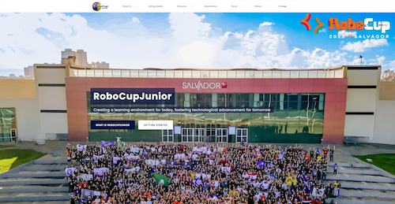
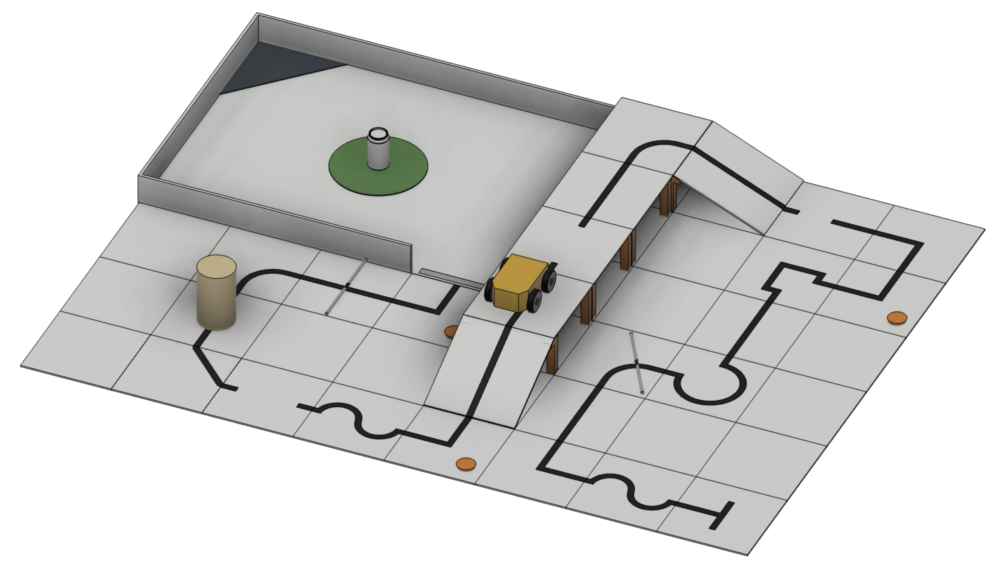

= RoboCupJunior Rescue Line Entry           Rules 2026
Last update: {docdate}
:url-repo: https://gitlab.com/rcj-rescue-tc/line
////
ifdef::pdf-style[]
////
:toc: macro
////
endif::[]
ifndef::pdf-style[]
:toc: left
endif::[]
////
:toc-title: Contents
////
:toc-start: 3
:toc-placement: Summary
////
:sectanchors:
:sectlinks:
:xrefstyle: full
:section-refsig: Section
:sectnums:
:sectnumlevels: 3

ifdef::backend-html5[]
++++
<link rel="stylesheet" href="https://use.fontawesome.com/releases/v5.3.1/css/all.css" integrity="sha384-mzrmE5qonljUremFsqc01SB46JvROS7bZs3IO2EmfFsd15uHvIt+Y8vEf7N7fWAU" crossorigin="anonymous">

++++
endif::[]

:icons: font
:numbered:

[.text-right]

[cols="4,3,4,3", options="header"]
|===
2+^|RoboCupJunior Rescue Entry League Sub-Committee 2025-2026
2+^|RoboCupJunior Rescue Committee 2026

|[Chair] Evan Bailey
|Australia
|[Chair] Diego Garza Rodriguez 
|Mexico

|Elizabeth Mabrey
|United States
|Stefan Zauper
|Austria

|Naomi Chikuma
|Japan
|Csaba Aban Jr.
|Hungary

|Kanata Morimoto
|Japan
|Joann Patiño
|Panama

|Ryo Unemoto
|Japan
|Mahmoud Madi
|UAE

|
|
|Alexander Jeddeloh
|Germany

|
|
|Gonzalo Zabala
|Argentina

|===
[cols="4,3,4,3", options="header"]
|===
2+^|RoboCupJunior Exec 2026
2+^|Trustees representing RoboCupJunior

|Marek Šuppa
|Slovakia
|Julia Maurer
|USA

|Christian Häußler
|Germany
|Roberto Bonilla
|USA

|Margaux Edwards
|Australia
|
|

|Tatiana Pazelli
|Brazil
|
|

|Tom Linnemann
|Germany
|
|

|William Plummer
|Australia
|
|

|===

[discrete]
== Official Resources

[cols="1,1,1",hrows=1, options="header"]
|===
^|RoboCupJunior Official Website
^|RoboCupJunior Official Forum
^|RCJ Rescue Community Website

a|
[link=https://junior.robocup.org/]

[.text-center]
https://junior.robocup.org[https://junior.robocup.org]
a|
[link=https://junior.forum.robocup.org/]

[.text-center]
https://junior.forum.robocup.org[https://junior.forum.robocup.org]
a|
[link=https://rescue.rcj.cloud/]
image::media/communitysite.png[SITE,align=center]
[.text-center]
https://rescue.rcj.cloud[https://rescue.rcj.cloud]

|===

WARNING: Corrections and clarifications to the rules may be posted on the forum before updating this rule file. It is the responsibility of the teams to review the forum to have a complete vision of these rules.

<<<

[discrete]
== Before you read the rules

IMPORTANT: Please read through the https://junior.robocup.org/robocupjunior-general-rules/[RoboCupJunior General Rules] before proceeding with these rules, as they are the premise for all rules. The English rules published by the RoboCupJunior Rescue Committee are the only official rules for RoboCupJunior Rescue Line Entry 2026. The translated versions each regional committee can publish are only referenced information for non-English speakers to understand the rules better. It is the responsibility of the teams to read and understand the official rules.
These rules are designed as an introductory version for beginners. Please take care not to confuse them with other rule sets.

[discrete]
== Purpose and Scope

This document provides a general framework and recommendations for organizing competitions.
It is not intended to be prescriptive or exhaustive. Each local organizing committee may adapt or modify these guidelines flexibly to meet the needs and circumstances of their community.
The guiding principle is this: challenges must enrich students’ learning and problem-solving—not become obstacles that cause failure due to excessive technicalities. Overly complex or rigid requirements risk shifting focus away from education and but just into rule compliance.
Organizers are therefore encouraged to:

* Prioritize student growth and exploration above strict technical constraints.
* Ensure fairness while avoiding unnecessary complications.
* Adapt challenge complexity so it motivates learning rather than discourages participation.  inadvertently creating a false sense of “trickery”. 

By following these principles, competitions will remain true to their educational mission and provide meaningful, inspiring experiences for students.

When the robot reaches a victim, it must gently and carefully transport each one to a safe evacuation point where humans can take over the rescue. 

[discrete]
== Scenario

The land is too dangerous for humans to reach the victims. Your team has been given a difficult task. The robot must be able to carry out a rescue mission in a fully autonomous mode with no human assistance. The robot must be durable and intelligent enough to navigate treacherous terrain with hills, uneven land, and rubble without getting stuck. When the robot reaches the victims, it has to gently and carefully transport each one to the safe evacuation point where humans can take over the rescue. 

Time and technical skills are essential! Come prepared to be the most successful rescue team.

[.text-center]

<<<

[discrete]
== Summary

An autonomous robot should follow a black line while overcoming problems in a modular field formed by tiles with different patterns. The floor is white, and the tiles are on different levels connected with ramps.

Teams are not allowed to give their robot any information in advance about the field as the robot is supposed to recognize the area by itself. The robot earns points as follows:

* 10 points for following the correct path on a tile at an intersection.
* 10 points for overcoming each obstacle (bricks, blocks, weights, and other large, heavy items). A robot is expected to navigate various obstacles.
* 10 points for reacquiring the line after a tile with one or more gaps.
* 10 points for each successfully navigated ramp tile .
* 10 points for negotiating a tile with one or more speed bumps.
* 10 points for each victim removed from the Victim area (green circle).
* 30 points for each victim successfully rescued.
If the robot gets stuck in the field, it can be restarted at the last visited checkpoint. The robot will earn points when it reaches new checkpoints. Last on the path, there will be a rectangular zone with walls (It’s called the evacuation zone). The evacuation zone is delimited in the entrance with a reflective silver tape strip attached to the floor.  
In the evacuation zone the robot has to locate and transport the victims to the designated evacuation point. 

<<<
toc::[]
<<<

[[general-rules]]
include::general-rules/general-rules.adoc[]

include::1.CodeOfConduct.adoc[]

include::2.Field.adoc[]

include::3.Robots.adoc[]

include::4.Play.adoc[]

include::5.Competition.adoc[]

include::6.OpenTechnicalEvaluation.adoc[]

include::7.ConflictResolution.adoc[]

<<<
